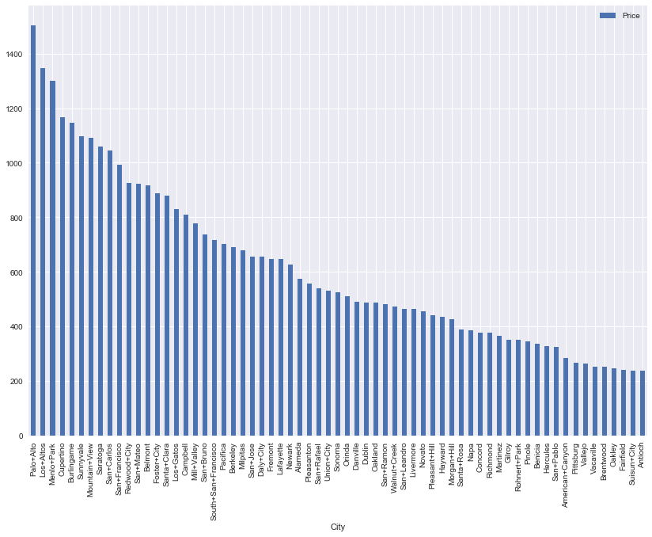

# Project1
Team Project #1: plotting ideal solar farm locations

Members: Nurgul, Aaron, Tara

Goal: The goal of this project was to examine the three main factors that will influence the ROI and profitability of a solar farm: land price, hours of sunlight, and temperature.

We wanted to explore the variability in the San Franisco Bay Area for each of these three factors. To this end we looked at cities in all 9 Bay Counties, gathering relevant data.

1. Real estate - major factor the will determine the price of a solar installation
2. Sunlight hours - will determine how much power the solar farm can generate
3. Maximum temperature - this affects the efficiency of the solar farm. Higher temperatures reduce efficiency.

**Real Estate**
This data came from a Tabelau report from Redfin, looking at average real estate price per square foot within each city of interest.

**Sunlight Hours**
This data was pulled from one year of data from WorldWeatherOnline.

**Maximum Temperature Data**
This was pulled using an API call from the WorldWeatherOnline dataset for 1 year of past data.

## Results

Real Estate Pricing Data:

Sunlight Hours Data:

Maximum Montly Temperatures:

**Data Totals and Score for Best Location**

**Results mapped onto Google Maps.**
Lighter colors are poorer locations, and darker colors are better locations for a solar farm considering price and the power a solar farm could generate

